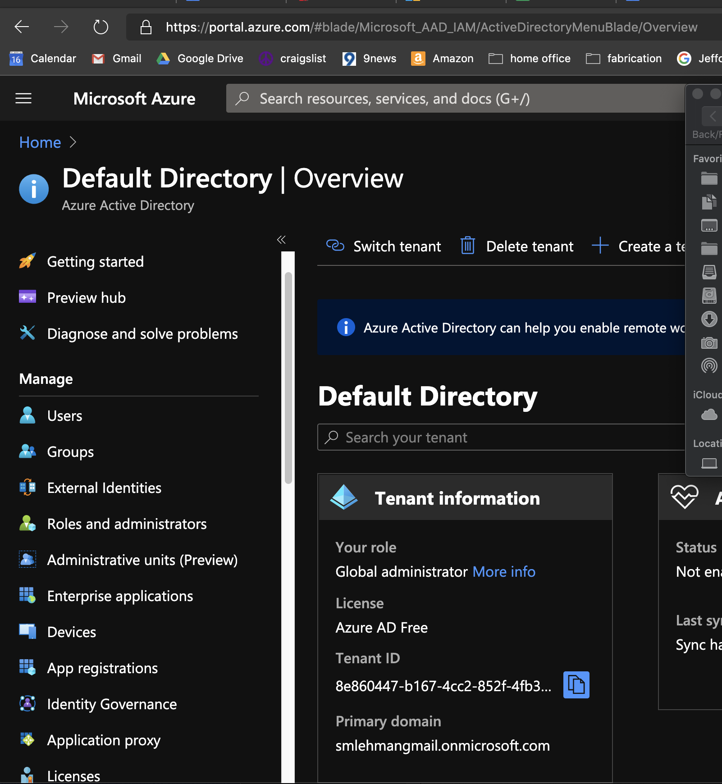
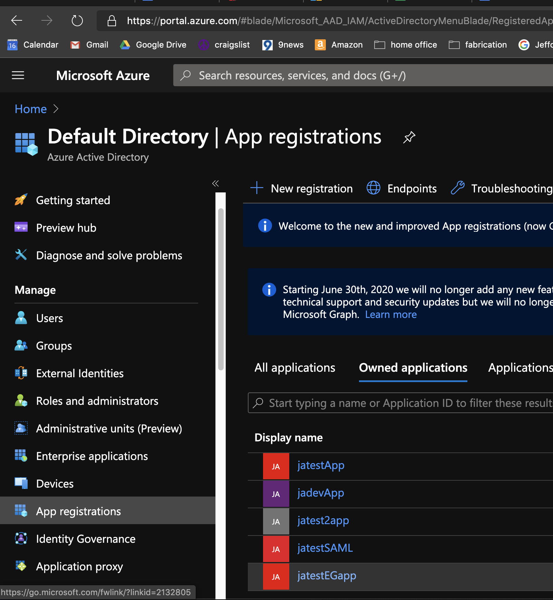
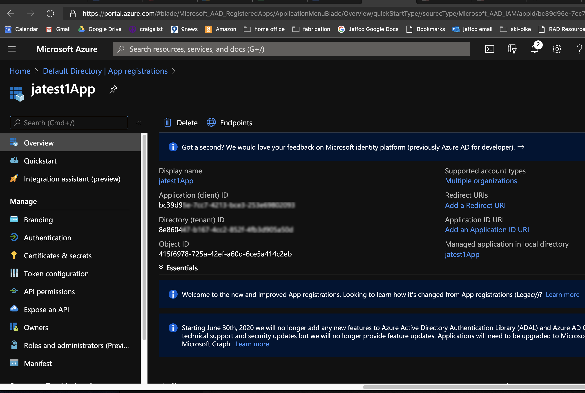
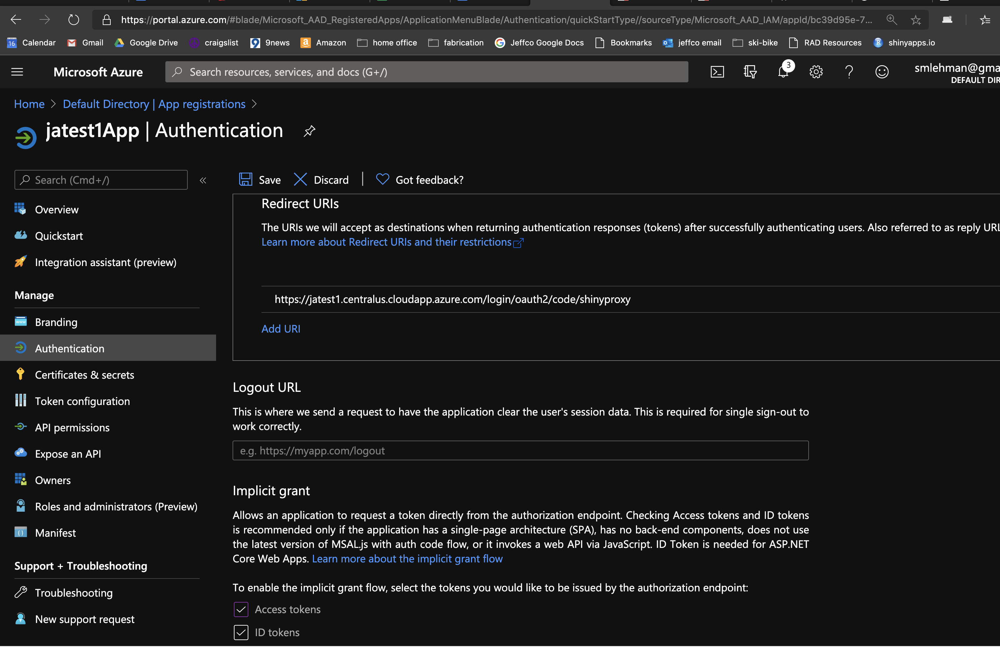
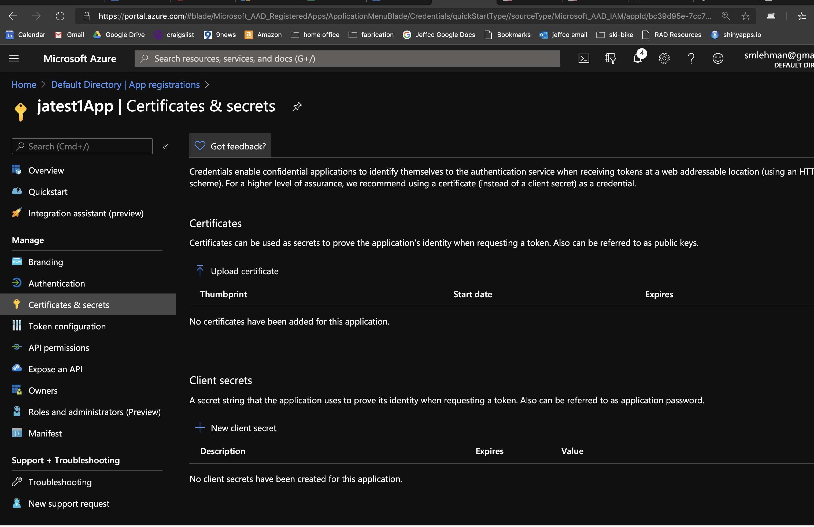
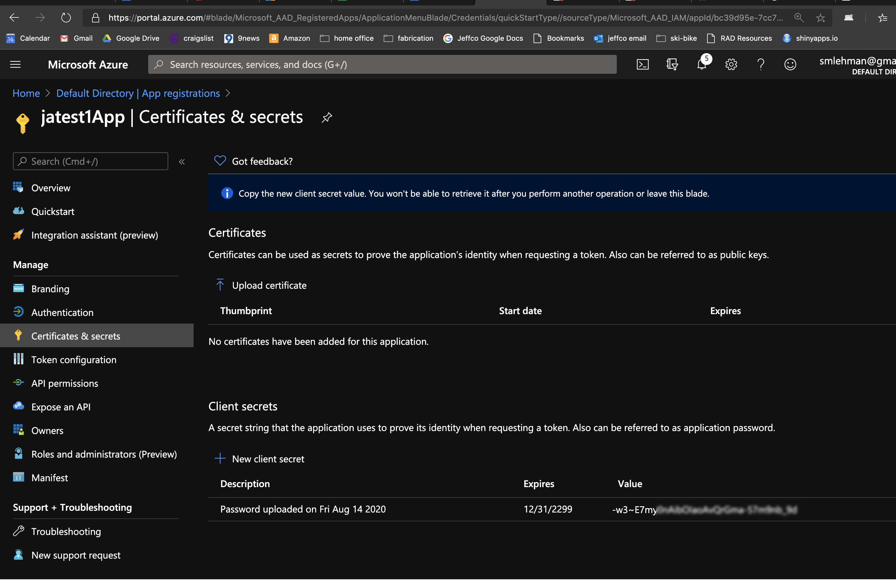
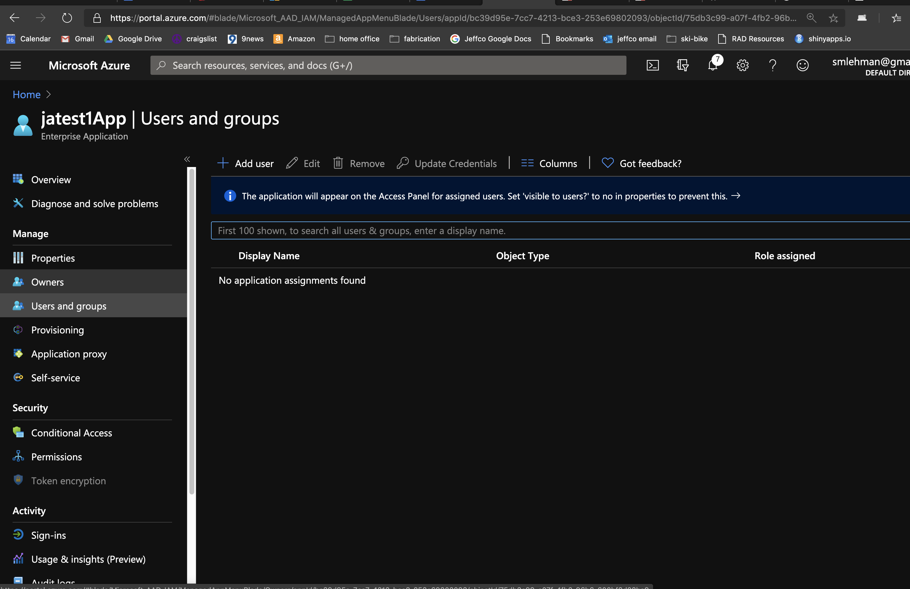
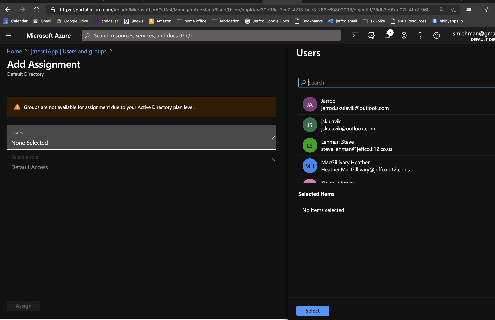

# Steps to build ShinyProxy on Azure
Instructions for building a ShinyProxy service deployed on Kubernetes, Authenticated via OAuth and AAD with ingress controlled by NGINX and TSL certs generated by letsencrypt.
## 1. Build Docker containers - push to Azure Container Registry (ACR)
Build app container with Docker and push it to Azure Container Registry (ACR).  
  - See **Appendix A** and **B** for building docker images and creating an ACR.
  - See the end of **Appendix B** for information on setting an image pull secret. 
  - Requires: docker, Azure, kubernetes, helm CLIs.

## Set up a cluster with shinyproxy in it.
 1. Assume working ACR
 - If you don't have a working set of docker images (e.g. - shinyproxy-server, sidecar, and dockerized apps), you'll need to set up an ACR (Azure container registry), push images to it, and save a secret. 
 2. Create new `shinyproxy-server` image: 
   - Docker build, tag and push a new docker `shinyproxy-server` image with a new tag to identify it as being for the new dev/test/prod cluster.
   - Later you will come back, modify (an save!) `application.yml` to referenece an AAD application ID and secret, and rebuild this `shinyproxy-server` image.  
Example code: 

 - `docker build . -t shinyproxy-server` (don't forget the dot)  
 - `docker tag shinyproxy-server <acrName>.azurecr.io/shinyproxy-server`
 - `docker push <acrName>.azurecr.io/shinyproxy-server`

 3. Create new resource group
  `az group create --name myResourceGroup --location centralus`  
 4. Create new AKS cluster in that resource group
  `az aks create --resource-group myResourceGroup  --name myAKSCluster  --node-count 2  --generate-ssh-keys  --attach-acr <acrName>`


## 2. Build ShinyProxy micro-service in Kubernetes 
 -  Authentication via OAuth & AAD
 -  NGINX ingress controller
-  TLS certificate via letsencrypt
### Create Kubernetes cluster  
Set up an alias to save yourself some time!  `alias k=kubectl`  (bash shell)  
My cluster will be called `jatest1AKS` and I will use jatest1 in most of the names associated with shinyproxy in this cluster.
 -  `az aks create --resource-group jatestRC --name jatest1AKS --node-count 2 --generate-ssh-keys --attach-acr jatestACR`  
 -  `az aks get-credentials --resource-group jatestRC --name jatest1AKS`  

### build docker images
 -  `cd sp-server`  
 -  `docker images`  
 -  `az acr login --name jatestACR`  
 -  `docker build --tag jatestacr.azurecr.io/shinyproxy-server:jatest1 .`  -- Don't forget the dot  
 -  `docker push jatestacr.azurecr.io/shinyproxy-server:jatest1`  

### install NGINX ingress controller
 -  `helm repo add stable https://kubernetes-charts.storage.googleapis.com/`  
 -  `helm repo update`  
 -  `k create namespace ingress-basic`  
 -  `helm install stable/nginx-ingress  --set controller.replicaCount=2  --set controller.nodeSelector."beta\.kubernetes\.io/os"=linux --set defaultBackend. nodeSelector."beta\.kubernetes\.io/os"=linux --generate-name --namespace ingress-basic`  

### set DNSNAME
 -  `kubectl get service -l app=nginx-ingress --namespace ingress-basic` This should produce a table showing you the external IP that your ingress controller will operate on.  Copy that IP address.  
 The table will looks something like this.   
 <pre>  
NAME                                       TYPE           CLUSTER-IP     EXTERNAL-IP      PORT(S)                      AGE  
kubernetes                                 ClusterIP      10.0.0.1       <none>           443/TCP                      26d  
nginx-ingress-1579236033-controller        LoadBalancer   10.0.202.217   52.154.219.46    80:31988/TCP,443:30838/TCP   16m  
nginx-ingress-1579236033-default-backend   ClusterIP      10.0.247.204   <none>           80/TCP                       16m   
shinyproxy                                 ClusterIP      10.0.113.90    <none>           8080/TCP                     26d  
</pre>
 -  `IP="52.154.219.46"`  --Replace "52.154.219.46" with the IP address you just copied(Make sure to put quotes around the IP) )  
 -  `DNSNAME="jatest1"`  --Replace "jatest1" with whatever name you want to start your URL with.  
 -  `PUBLICIPID=$(az network public-ip list --query "[?ipAddress!=null]|[?contains(ipAddress, '$IP')].[id]" --output tsv)`  
 -  `az network public-ip update --ids $PUBLICIPID --dns-name $DNSNAME`  
 -  `az network public-ip show --ids $PUBLICIPID --query "[dnsSettings.fqdn]" --output tsv`  This will display the Fully-Qualified Domain Name. Copy this name. You'll need it later.  

### register app with AAD
 -  Go to AAD blade in Azure  
   
 -  Go to the AppRegistrations blade and click `+ New Registration` to add an app.  
     
 - A dialog screen will open.  
      
 -  Give your app a name.  
 -  Under 'Supported account types', select "Accounts in any organizational directory (Any Azure AD directory - Multitenant)" 
 -  In the "Redirect URI" (it is not "optional"), enter the Fully Qualified Domain Name (FQDN) that you copied with the following format. `https://<yourFQDN>/login/oauth2/code/shinyproxy` -- Replace `<yourFQDN>` with the FQDN you copied above in "set DNSNAME" section. --Don't include the `<>`. e.g., `https://jatest1.centralus.cloudapp.azure.com/login/oauth2/code/shinyproxy`.  
 - Click "Register"  
 - You are now in a blade for the application you just created.  
     
 -  Click on the "Redirect URI" link. It will either be "Redirect URIs" or "Add a redirect URI". (on the right side of your screen.)
     
 -  Add "Implicit Grant" permissions.  Check both "Access Tokens" and "ID Tokens" and save your changes. If asked, set them to "email"  ##TODO## Add Javid's images.  
 -  You should now be back at the blade with all the app's specifications.  Select "Certificates and secrets" from the menu on the left.  
    
 -  Click "+ New client secret"  
    
 -  IMPORTANT:  Copy this secret and save somewhere for future reference! You will need it later. After leaving this page, you will not be able to see this secret again.  
 - Go back to the main AAD blade.  
 - In the right menu, select "Enterprise applications", and then select your app from the list.  
    
 -  Select "Users and groups" from the right menu, and click "+ Add user". 
    
 - Click on "Users" and add the users from your AAD who you want to have access to the app. Click "Select". 
 - Your app is now set up to authenticate using AAD.

### rebuild shiny proxy server (if needed)
 -  If you have created a new AAD app (above) open `application.yml` and replace the `client-id` with the application ID from your app. Replace the `client-secret` with the secret you created and saved above.  
 If application.yml hasn't been used for your Azure tenant, you will also need to change the `auth-url` and the `token-url`.  
        `auth-url: https://login.microsoftonline.com/<AzureSubscriptionID>/oauth2/authorize`  
        `token-url: https://login.microsoftonline.com/<AzureSubscriptionID>/oauth2/token`  
 -  If you've changed anything in application.yml, rebuild the sp-server container.  
 -  Navigate to the folder where your ShinyProxy Dockerfile is located. (sp-server in my directory)
 -  `cd sp-server`  
 -  `docker build --tag jatestacr.azurecr.io/shinyproxy-server:jatest1 .`  
 -  `docker push jatestacr.azurecr.io/shinyproxy-server:jatest1`   
 
### install cert-manager
 -  `kubectl apply --validate=false -f https://raw.githubusercontent.com/jetstack/cert-manager/v0.13.0/deploy/manifests/00-crds.yaml`  
 -  `kubectl label namespace ingress-basic cert-manager.io/disable-validation=true`  
 -  `kubectl create namespace cert-manager`  
 -  `helm install cert-manager --namespace cert-manager --version v0.13.0 jetstack/cert-manager`  
 -  `k get po --namespace cert-manager`  

### set up cert and ingress route.  Create authorization, create service and deploy
 -  `cd ../`  (returning to my shinyproxy directory)
 -  `k apply -f ingress_controller/cert-setup.yaml`  (ingress_controller directory holds my cert-setup and my ingress route manifests)
 -  `k apply -f ingress_controller/sp-ingress.yaml`  
 -  `k apply -f sp-service.yaml`  
 -  `k apply -f sp-authorization.yaml`  
 -  `k apply -f sp-deployment.yaml`  


************************
 
## Appendix A: Creating Azure Container Registry
 #### Create Azure Resource Group and an Azure Container Registry (ACR)
...using the Azure CLI  
Create or connect to an Azure Container Registry (ACR) --if needed create a resourceGroup -- see https://docs.microsoft.com/en-us/azure/aks/tutorial-kubernetes-prepare-acr  
-- resource group creation (if needed)  Note: the location matters...some locations do not support kubernetes.  
`az group create --name <myResourceGroup> --location centralus`  
(replace <myResourceGroup> with the name you want for your resource group.)

-- ACR creation   
`az acr create --resource-group <myResourceGroup> --name <acrName> --sku Basic`  

  -- or if you just need to log in --   
-- ACR login  
`az acr login --name <acrName>`  

-- Get the ACR login server address  

`az acr list --resource-group <myResourceGroup> --query "[].{acrLoginServer:loginServer}" --output table`  
Output looks something like this.  
```
AcrLoginServer
--------------------
jatestacr.azurecr.io
```

*****************************
## Appendix B: Creating Docker images
Build a container with your application
For our purposes, we will need to build at least 3 containers.  
 1. A container the holds our Shiny app.
 2. A container with the shinyproxy server.  Note: This app will need to be rebuilt with Azure Container Registry secret, ACR path and Active Directory app ID and app secret. 
 3. A container with the shinyproxy sidecar
#### Build a container  
`docker build` the containers you need.  

1. Navigate to the directory where Dockerfile exists (Dockfile for our app is in the root directory. For the shinyproxy server, in sp-server. For the sidecar, in kube-proxy-sidecar)
2. Build new container image:  
`docker build -–tag $NAME_OF_CONTAINER:$TAG_TO_DESCRIBE_CONTAINER_VERSION . `  
e.g., `docker build --tag edai:app . `  
    **--** note the period at the end of the command.  
To save time, copy the Azure repo name (the repo name you found by running the last command of Appendix A.), and include that in your tag.  
e.g., `docker build --tag jatestacr.azurecr.io/edai:app . `  

3. Or you can tag image with azure ACR repo name after building it.
    `docker tag $NAME_OF_CONTAINER:$TAG_TO_DESCRIBE_CONTAINER_VERSION   $AZURE_ACR_REPO_NAME/$NAME_OF_CONTAINER:$TAG_TO_DESCRIBE_CONTAINER_VERSION . `  
    `docker tag edai/app jatestacr.azurecr.io/edai:app .`  
3. Push new container image to Azure Container Registry:  
`docker push $AZURE_ACR_REPO_NAME/$NAME_OF_CONTAINER:$TAG_TO_DESCRIBE_CONTAINER_VERSION`  
`docker push jatestacr.azurecr.io/edai:app`  


Check with  
`docker images`  

#### check to see if your Shiny app container is working by launching manually
--documentation from shinyproxy  https://www.shinyproxy.io/troubleshooting/  
By means of example, let's assume the hello application of the `openanalytics/shinyproxy-demo` image does not work properly. In the default `application.yml` we can see that it is being run using

```yaml
  specs:
  - id: 01_hello
    container-cmd: ["R", "-e", "shinyproxy::run_01_hello()"]
    container-image: openanalytics/shinyproxy-demo
    access-groups: [scientists, mathematicians]
```  
In other words, the docker command (`container-cmd`) used is `["R", "-e", "shinyproxy::run_01_hello()"]`.

In order to run it 'manually' (using the docker command line interface) we can do the following:  

`sudo docker run -p 3838:3838 openanalytics/shinyproxy-demo R -e 'shinyproxy::run_01_hello()' `   
`docker run -p 3838:3838  jatestacr.azurecr.io/edai:app R -e "shiny::runApp('/srv/shiny-server/edai/')"`  

#### Create a secret to authenticate with a registry (ACR) so you can pull a private image
 - View the `config.json` file:
 `cat ~/.docker/config.json`
 - Create secret based on existing Docker credentials -- log into ACR (see above) -- NOTE: you will need to look to find where .docker/config.json is stored on you machine - in this example it is located at /Users/steve/.docker/config.json.  
 `kubectl create secret generic regcred --from-file=.dockerconfigjson=/Users/steve/.docker/config.json --type=kubernetes.io/dockerconfigjson`  
  `kubectl create secret generic jatest-regcred --from-file=.dockerconfigjson=/Users/steve/.docker/config.json --type=kubernetes.io/dockerconfigjson`  
 - This creates a secret named `regcred` (or `jatest-regcred`) that is called in the `application.yaml` so that the containers can be accessed. If you change the name from `regcred` you will need to also change it in the `application.yaml` and the `sp-deployment.yaml` files.

************************
## Appendix C: Useful Kubernetes commands
create alias for kubectl `alias k=kubectl`  

create AKS cluster  
 `az aks create --resource-group myResourceGroup  --name myAKSCluster  --node-count 2  --generate-ssh-keys  --attach-acr <acrName>`  
get AKS credentials  
    - `az aks get-credentials --resource-group myResourceGroup --name myAKSCluster`  

get pod information  
`k describe po <podname>`  

run R inside shinyproxy  
 - Get the pod status and name --po is short for pod  
 `k get po`  
 - Get a lot of description of pod  
 `k describe po <podname>`
 - Get deployment status  
 `k get deploy`  
 - Get secret(s) of the cluster  
 `k get secret`  
 `k get secret -n ingress-basic`  - this gets the secrect(s) in a namespace  
 - Look at deployment of pod in yaml format  
 `k get deploy shinyproxy -o yaml`  
 - Edit the deployment yaml  
 `k edit deploy shinyproxy`  
 - Run the shinyproxy pod -- paste in the name after -it (interactive) - run in bash /bin/bash  
 `k exec -it sp-pod-39e25347-5dec-44f9-9206-bf7c9895765b /bin/bash`  
 `k exec  sp-pod-29c47e54-396d-453d-98f5-5ef22ad472d7  -i -t --ls -als /serv/shiny-server/edai/data -h
- Get the service info  
`k get svc`  
- Get log for pods  
`k logs shinyproxy-6dbf7d6fc9-wtcn5 --tail 50 -c shinyproxy`  
- get something  
`k get po -o wide`  
`k get storageclass`
`k get secret`
- destroy cluster  
`k delete deployment <name>`  
- get service of aks-helloworld app in the ingress-basic namespace and look at the yaml  
`k get svc aks-helloworld -n ingress-basic -o yaml`  
- get logs of containers  
`k logs <podname> <containername> --tail 100`  
`k logs shinyproxy-6bf4767c5c-zdvch kube-proxy-sidecar --tail 100`  
`k logs shinyproxy-66cd78d45d-ngnvj -c shinyproxy > shinyproxyError.log`  #save error logs of shinyproxy (-c is "container" -- specify which of the two containers in the pod to get logs) to shinyproxyError.log   

*****************************
## Appendix D: Setup ingress with CA certificate  
This replaces the cert-setup.yaml that uses letsencrypt  


*****************************
## Appendix E: Setting up a Kubernetes persistent volume for shinyproxy
Enables data to be saved outside of app...  
<!-- 
https://docs.microsoft.com/en-us/azure/container-instances/container-instances-volume-azure-files  

### Change these four parameters as needed
ACI_PERS_RESOURCE_GROUP=myResourceGroup  
ACI_PERS_STORAGE_ACCOUNT_NAME=mystorageaccount$RANDOM  
ACI_PERS_LOCATION=eastus  
ACI_PERS_SHARE_NAME=acishare  

`ACI_PERS_RESOURCE_GROUP=jatestRC`  
`ACI_PERS_STORAGE_ACCOUNT_NAME=jadatastorage$RANDOM`  
`ACI_PERS_LOCATION=centralus`  
`ACI_PERS_SHARE_NAME=jadatashare`  

### Create the storage account with the parameters
az storage account create \  
    --resource-group $ACI_PERS_RESOURCE_GROUP \  
    --name $ACI_PERS_STORAGE_ACCOUNT_NAME \  
    --location $ACI_PERS_LOCATION \  
    --sku Standard_LRS  

- one line
`az storage account create  --resource-group $ACI_PERS_RESOURCE_GROUP --name $ACI_PERS_STORAGE_ACCOUNT_NAME --location $ACI_PERS_LOCATION --sku Standard_LRS`

### Create the file share
az storage share create \  
  --name $ACI_PERS_SHARE_NAME \  
  --account-name $ACI_PERS_STORAGE_ACCOUNT_NAME
  
- one line...  
`az storage share create --name $ACI_PERS_SHARE_NAME --account-name $ACI_PERS_STORAGE_ACCOUNT_NAME`

### Get storage credentials (3)  
 - 1. Storage account name  
   - To see storage account name...  
   - `echo $ACI_PERS_STORAGE_ACCOUNT_NAME`  
 - 2. Share name - This value is already known (defined as acishare in the preceding script)  
 - 3. Storage account key  
   - `STORAGE_KEY=$(az storage account keys list --resource-group $ACI_PERS_RESOURCE_GROUP --account-name  $ACI_PERS_STORAGE_ACCOUNT_NAME --query "[0].value" --output tsv)`  
   - `echo $STORAGE_KEY`  
 - 4. Create a kubernetes secret  
   -  `kubectl create secret generic azure-secret --from-literal=azurestorageaccountname=jadatastorage13251 --from-literal=azurestorageaccountkey=lPzbCb53nP3LS5Tq7U4RRI1G+nUF+zYGMNzosFVY74fm7n7rW+DrLZJwZGAKpalwWESqGic4lErCdnt0QmlstQ==`   
   - Creates a secret named azure-secret
### Deploy container and mount volume  

az container create \
    --resource-group $ACI_PERS_RESOURCE_GROUP \
    --name `hellofiles` \
    --image mcr.microsoft.com/azuredocs/`aci-hellofiles` \
    --dns-name-label `aci-demo` \
    --ports 80 \
    --azure-file-volume-account-name $ACI_PERS_STORAGE_ACCOUNT_NAME \
    --azure-file-volume-account-key $STORAGE_KEY \
    --azure-file-volume-share-name $ACI_PERS_SHARE_NAME \
    --azure-file-volume-mount-path `/aci/logs/`  

- on one line...  
`az container create --resource-group $ACI_PERS_RESOURCE_GROUP --name hellofiles --image mcr.microsoft.com/azuredocs/aci-hellofiles --dns-name-label aci-demo --ports 80 --azure-file-volume-account-name $ACI_PERS_STORAGE_ACCOUNT_NAME --azure-file-volume-account-key $STORAGE_KEY --azure-file-volume-share-name $ACI_PERS_SHARE_NAME --azure-file-volume-mount-path /aci/logs/`


### OR -- deploy with yaml?
```yaml
apiVersion: '2019-12-01'
location: centralus
name: file-share-demo #edAI_container #?
properties:
  containers:
  - name: hellofiles ## edAI:nodata #?
    properties:
      environmentVariables: []
      image: mcr.microsoft.com/azuredocs/aci-hellofiles ## jatestacr.azurecr.io/edai:nodata
      ports:
      - port: 80 #? 8080, 443, 3838
      resources:
        requests:
          cpu: 1.0
          memoryInGB: 1.5
      volumeMounts:
      - mountPath: /aci/logs/ # /srv/shiny-server/edai/data/  #??
        name: filesharevolume # ?
  osType: Linux
  restartPolicy: Always
  ipAddress:
    type: Public #?
    ports:
      - port: 80 # 8080, 443, 3838
    dnsNameLabel: aci-demo ## edAi_aci
  volumes:
  - name: filesharevolume #?
    azureFile:
      sharename: jadatashare
      storageAccountName: jadatastorage13251
      storageAccountKey: <Storage account key>
tags: {}
type: Microsoft.ContainerInstance/containerGroups
```


### Manage files in mounted volume  

`az container show --resource-group $ACI_PERS_RESOURCE_GROUP --name hellofiles --query ipAddress.fqdn --output tsv` -->


*****************************
## Appendix F: Stopping/Starting the cluser with StartStop
 https://docs.microsoft.com/en-us/azure/aks/start-stop-cluster  
 Stop a cluster   
`az aks stop --name myAKSCluster --resource-group myResourceGroup`  
`az aks stop --name jatest1AKS --resource-group jatestRC`  

You can verify when your cluster is stopped by using the [az aks show][az-aks-show] command and confirming the powerState shows as Stopped  

Start cluster  
`az aks start --name myAKSCluster --resource-group myResourceGroup`  
`az aks start --name jatest1AKS --resource-group jatestRC`  


